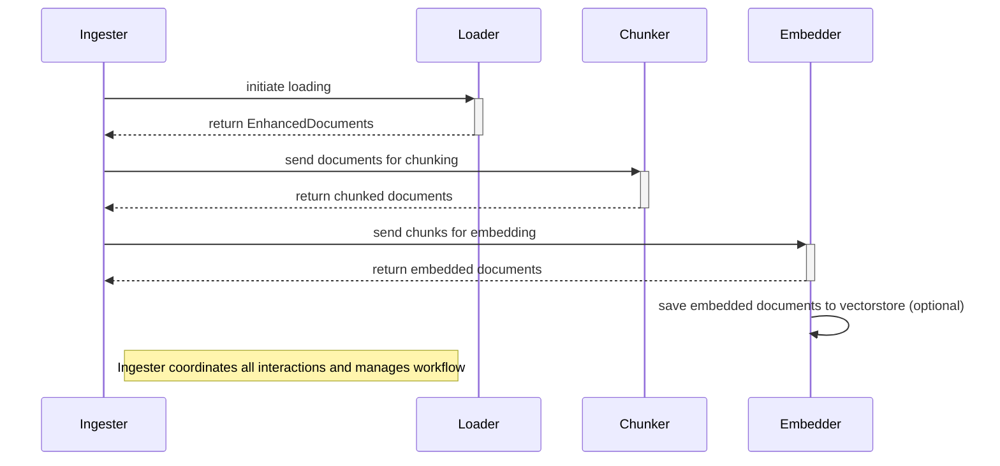

### Design Overview

#### Class Structure
Here's the high level overview of the classes and how they interact with each other.

While the right level of abstraction when ingesting textual data into a vectorstore is somewhat subjective, three distinct steps stand out:

1. Standardizing the input dataset.
2. Chunking the standardized data.
3. Embedding the chunked data.

Additionally, we make the assumption that the usual access pattern here is that we would want to use the same loading, chunking, and embedding mechanism across multiple datasets within a given application, since this would provide consistency for downstream applications. With this assumption, it makes sense to have a `Loader`, `Chunker`, and `Embedder` class. Each instance of the class would share state information like how it should load, chunk, and embed data. We also have an `Ingester` class, which is responsible for transferring data through the instances of the three classes mentioned earlier.

Another layer of abstraction that proves useful is that of a `EnhancedDocument` [^3], which is essentially a piece of text accompanied by some additional information. The key information any `EnhancedDocument` must have is the following:

1. `source`: the path of the file. We assume the dataset is static (i.e. the raw data does not change).
2. `page_content`: the actual text of the file.
3. `metadata`: additional information about the document. Often useful for querying within the context of knowledge graphs.
4. `document_hash`,  `content_hash`, `metadata_hash`: hashes of the content, metadata, and overall document. Useful for uniqueness checks.

Since there is a one-to-many relationship between a `EnhancedDocument` and its chunks - the chunk retains the original document's `source` and `metadata` - the *type* of a chunk is the same as the type of an "unchunked" document. Hence, the package treats chunks data as `EnhancedDocuments` too.

Each class performs actions related to its position in the ingestion pipeline. The unit of information being transferred between classes is an `EnhancedDocument`. 

#### Misc Implementation Details

- For performance reasons, I've tried to use iterators and batching where possible, both to leverage vectorization and to be more space efficient. 
- For its first iteration, this package does not try to implement upserts/idempotence, nor does it clean indexes (this is the main purpose of LangChain's Indexing API, but I didn't get the time to implement this).
- I did not try to optimize the size of the package itself by reducing the dependencies used - I figured this would not be the limiting factor here. There are probably unused dependencies.[^4]

##### Footnotes

[^3]: The package doesn't use the name `Document` since LangChain has claimed that name. Also, LangChain has a `_HashedDocument` class that offers similar functionality, but since its a private class, it isn't used by this package.

[^4]: Last minute issues with package conflicts in Google Colab forced me to reduce the size of the dependencies...